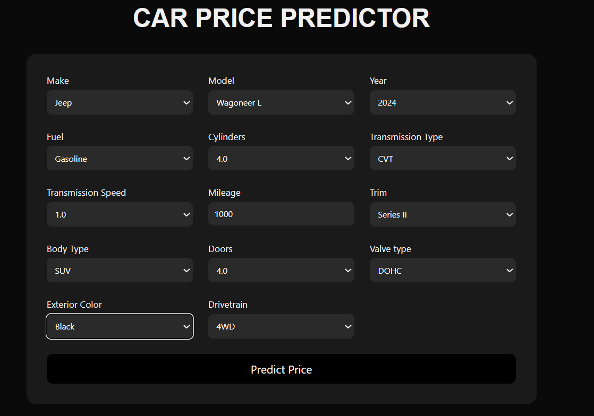

# Vehicle Price Prediction

This is a machine learning web application that predicts vehicle prices based on their specifications using Ridge Regression. The project includes a complete data preprocessing pipeline, model training workflow, and a Flask-based web interface to make predictions interactively.

## Project Overview

- Predicts the price of vehicles using features like make, model, year, mileage, engine specs, transmission, and more.
- Built using Python, Flask, and scikit-learn.
- Cleaned dataset is used to train a Ridge Regression model.
- The application runs locally and provides a simple web form for user input.

## Dataset Description

The dataset (`dataset.csv`) contains records of various vehicles with features commonly found in listings or inventory systems. After preprocessing, the cleaned dataset (`Cleaned_data.csv`) is used for model training and web form population.

### Raw Columns (Before Cleaning)
- `name`, `description`: Unstructured text fields not used in the model.
- `make`, `model`, `year`, `price`: Basic identifying fields.
- `engine`, `cylinders`, `fuel`, `mileage`, `transmission`, `trim`, `body`, `doors`, `exterior_color`, `interior_color`, `drivetrain`: Core features used or processed.

### Cleaned Columns (Used for Modeling)
- Categorical: `make`, `model`, `fuel`, `trim`, `body`, `drivetrain`, `transmission_type`, `valve_type_simplified`, `exterior_combo_interior`
- Numerical: `year`, `mileage`, `cylinders`, `doors`, `transmission_speed`
- Target: `log_price` (log-transformed version of `price`)

## Model Accuracy & Performance

The vehicle price prediction model was built to estimate the **log-transformed price** of a car based on various attributes such as brand, fuel type, mileage, year, engine specifications, and more.

###  Models Trained

- **Linear Regression**
- **Ridge Regression**
- **Lasso Regression**

These models were trained using a full scikit-learn pipeline that included preprocessing steps like feature scaling and one-hot encoding.

###  Evaluation Metrics Used

- **R² Score**: Measures how well the model explains the variance in the target variable.
- **RMSE (Root Mean Squared Error)**: Indicates the average error between predicted and actual values (in log scale).

###  Model Performance Summary

| Model              | R² Score | RMSE     |
|-------------------|----------|----------|
| Linear Regression | **0.8914** | **0.1136** |
| Ridge Regression  | 0.8896   | 0.1146   |
| Lasso Regression  | -0.0020  | 0.3451   |

###  Insights & Observations

- **Best Performing Model:**  
  - **Linear Regression**, with an R² of **0.8914**, indicating that it explains ~89% of the variance in car prices.
- **Ridge Regression** also performed well and helps reduce overfitting by applying L2 regularization.
- **Lasso Regression** did not perform well in this case, likely due to over-penalizing relevant features.

###  Technologies Used

- Python
- scikit-learn
- Pandas, NumPy
- Matplotlib, Seaborn
- Flask (for web deployment)


## Demonstration

<br><br>



<br><br>


## How to Run the App

1. Clone the repository:

   ```bash
   git clone https://github.com/your-username/vehicle-price-predictor.git
   cd vehicle-price-predictor
2. Create and activate a virtual environment:
   ```bash
   python -m venv venv
   source venv/bin/activate  # On Windows: venv\Scripts\activate
3. Install dependencies:
   ```bash
   pip install -r requirements.txt
4. Run the Flask app:
   ```bash
   python main.py
5. Open your browser and go to `http://127.0.0.1:5000` to use the predictor.

## Files Included
- `main.py`– Flask application script
  
- `RidgeModel.pkl` – Trained Ridge Regression model

- `Cleaned_data.csv` – Clean dataset used for prediction

- `dataset.csv` – Original raw dataset

- `vehicleprediction.ipynb` – Jupyter notebook for cleaning, feature engineering, and training

- `requirements.txt `– Project dependencies

- `templates/index.html` – Frontend form interface

- `README.md` – Project documentation

